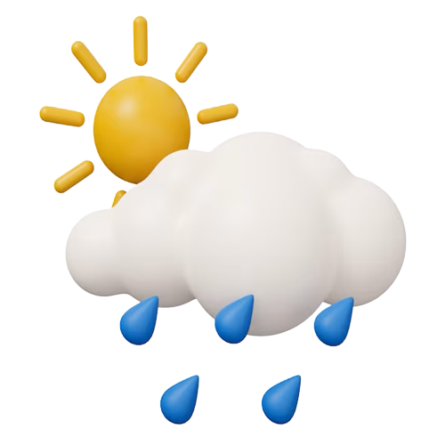
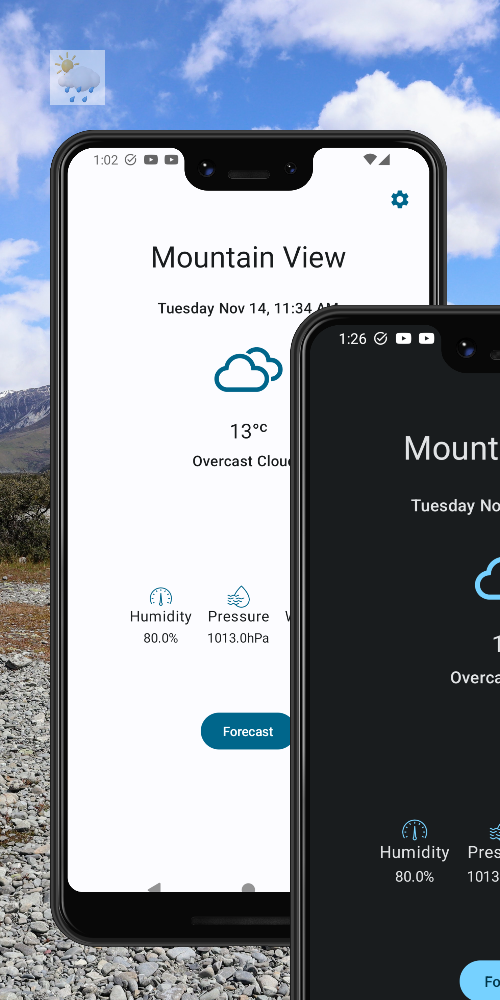
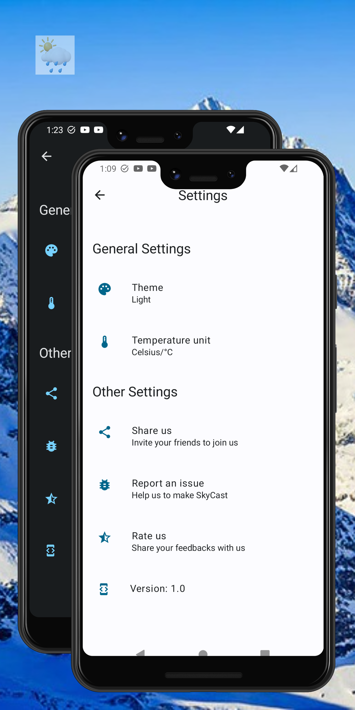
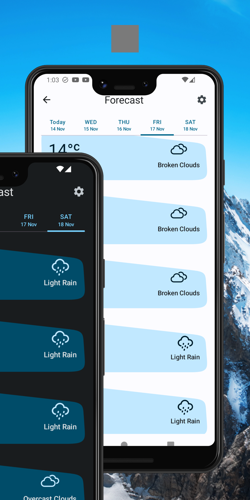
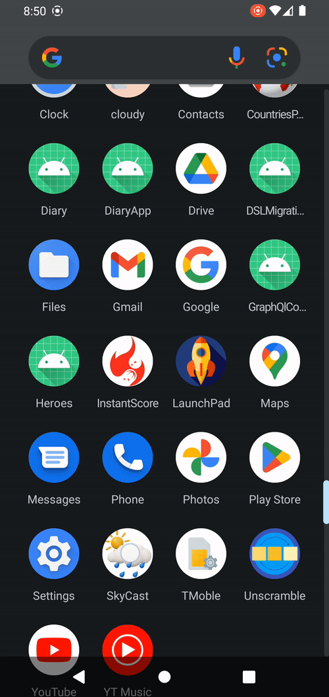
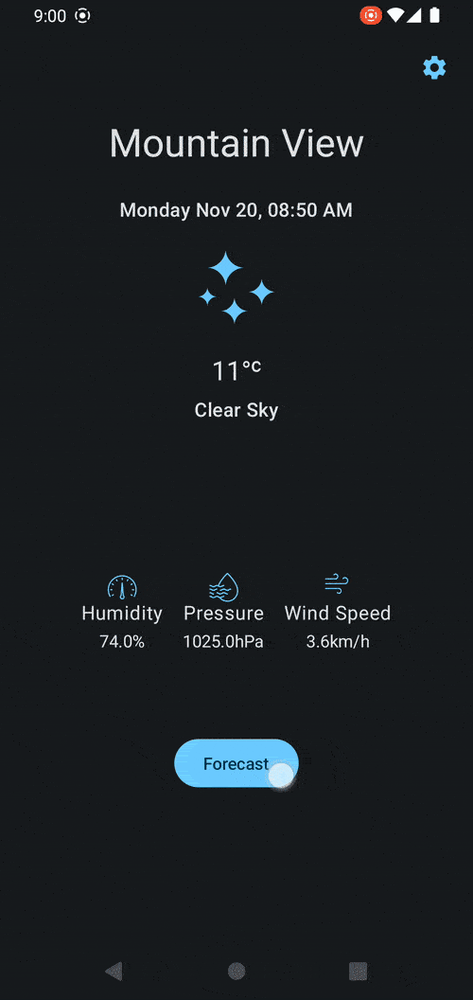
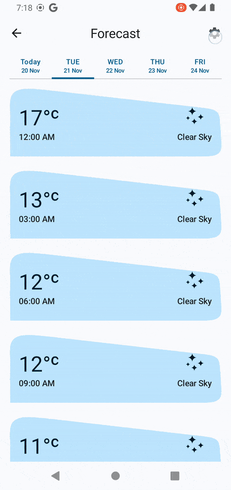

 

  

<h1 align = "center">
<b><i>SkyCast</i></b>
</h1>

  

    Complete Multi-Modular Android App 
     

  
[Screenshots](#camera_flash-screenshots-camera_flash) ~
[Deployment](#arrow_lower_right-deployment-arrow_lower_right) ~
[Architecture](#hammer_and_wrench-architecture-hammer_and_wrench) ~
[Tech Stack](#building_construction-tech-stack-building_construction) ~
[Authors](#memo-authors-memo) ~
[Contributing](#handshake-contributing-handshake)  
[License](#scroll-license-scroll) 
 

    
SkyCast is a modern project written in Kotlin and powered by Jetpack Compose. Whether you're planning your day or embarking on a grand adventure, step into a world of weather precision and stay one step ahead of Mother Nature as you seamlessly track real-time forecasts to ensure you're prepared for whatever the sky has in store. 

Download now and make every day a weather-perfect day!"

# :camera_flash: **Screenshots** :camera_flash:

SkyCast follows the latest Material 3 guidelines for a visually appealing and a consistent UI.

 &nbsp;&nbsp;&nbsp;&nbsp;
 &nbsp;&nbsp;&nbsp;&nbsp;   
 &nbsp;&nbsp;&nbsp;&nbsp; 

# :arrow_lower_right: Deployment :arrow_lower_right:
These are the key parameters for Diary Project.

| Parameter      | Value |
|----------------|-------|
| compileSdk     | 34    |
| targetSdk      | 34    |
| minSdk         | 24    |
| composeVersion | 1.5.3 |
| kotlinVersion  | 1.9.10 |

You can clone the repository or download the Zip file [here](https://github.com/Tonnie-Dev/SkyCast).

To build and run the app, you will need the latest version of Android Studio Giraffe (or [newer](https://developer.android.com/studio/)) installed on your system.
# :hammer_and_wrench: Architecture :hammer_and_wrench:
### Modules

SkyCast is implemented as a single module app using Android Clean Architecture and follows the Model-View-ViewModel (MVVM) pattern.

It features 3️⃣ main layers:

1. **Data Layer** - This layer is responsible for managing data storage and dispensing data to the app. Retrofit API service provides the remote data which is then cached into the ROOM database for offline operations. 

2. **Domain Layer** - This layer holds the Business Logic for the InstantScores. It holds the models and the use cases that encapsulates the very complex logic for the app. This layer houses the interface definitions for connectivity, location and data store operations.

3. **UI Layer** - This is the presentation layer displays refined data to the user and facilitates interactions with the user. It contains the ViewModels holding the different states for SkyCast app.

### Navigation
The app has :three: screen destinations which use Compose Destinations Library ( [*See Issue 434*](https://github.com/raamcosta/compose-destinations/issues/434#issuecomment-1566126028) ) to manage navigation.

| :feature:auth                       | :feature:home                       | :feature:write                      |
|-------------------------------------|-------------------------------------|-------------------------------------|
|  |  |  |

- **Current Weather Screen**: Provides instant access to the latest temperature, wind speed, and conditions for your location at a glance.

- **Forecast Screen**: Has visually appealing display of the upcoming weather for 5 days that the user can swipe to and fro or just click.

- **Settings Screen**: Enables the user to customize the app with ease, adjusting themes, temperature units, and other settings to match their style and needs.

# :building_construction: Tech Stack :building_construction:

SkyCast project uses many popular libraries and tools in the Android Ecosystem:

* [Jetpack Compose](https://developer.android.com/jetpack/compose) - modern toolkit for building native Android UI.
  
* [Material Design 3](https://m3.material.io/) - an adaptable system of guidelines, components, and tools that support the best practices of user interface design.

* [Material Design 2](https://m2.material.io/) - Handle PullRefreshIndicator which is not yet implemented on Material 3.

* [Android KTX](https://developer.android.com/kotlin/ktx) - helps to write more concise and idiomatic Kotlin code.

* [Coroutines and Kotlin Flow](https://kotlinlang.org/docs/reference/coroutines-overview.html) - Coroutines help in managing background threads and reduces the need for callbacks. In addition to the `Flow`, SkyCast uses `callbackFlow` (*converts connection callbacks to Flow API*) and  `suspendCancellableCoroutine` (*allows suspending functions to interact with the underlying coroutine cancellation mechanism*)

* [Compose Destinations](https://github.com/raamcosta/compose-destinations) - used to handle all navigations and arguments passing while hiding the complex, non-type-safe and boilerplate code
  
* [Google Accompanist Libraries](https://github.com/google/accompanist) - these are a collection of extension libraries for Jetpack Compose. DiaryApp specifically uses Accompanist's Pager Library
* [Dagger Hilt](https://dagger.dev/hilt/) - used for Dependency Injection.
* [Coil](https://coil-kt.github.io/coil/) - an image loading library for Android backed by Kotlin Coroutines
* [SplashScreen API](https://developer.android.com/develop/ui/views/launch/splash-screen) - SplashScreen API lets apps launch with animation, including an into-app motion at launch, a splash screen showing your app icon, and a transition to your app itself.

* [Room](https://developer.android.com/topic/libraries/architecture/room) persistence library which provides an abstraction layer over SQLite to allow for more robust database access while harnessing the full power of SQLite.
* [Mongo](https://www.mongodb.com/) - MongoDB is a popular NoSQL database, used in this app for storing and managing data related to diary entries.
* [Firebase Storage](https://firebase.google.com/docs/storage/android/start) -  Firebase Cloud Storage is a scalable and reliable cloud storage solution used in the app for storing and retrieving photos associated with diary entries.
* [Firebase Auth](https://firebase.google.com/docs/auth/android/start) - Firebase Authentication provides a secure and easy-to-use authentication system, allowing users to sign in and access their diary entries securely.
* [Max Keppeler's Sheet Compose Dialog](https://github.com/maxkeppeler/sheets-compose-dialogs) - Firebase Authentication provides a secure and easy-to-use authentication system, allowing users to sign in and access their diary entries securely.

* [StevDza-San's MessageBarCompose](https://github.com/stevdza-san/MessageBarCompose) - Animated Message Bar UI that can be wrapped around your screen content in order to display Error/Success messages in your app. It is adapted and optimized for use with Compose and Material 3 projects.

* [StevDza-San's OneTapCompose](https://github.com/stevdza-san/OneTapCompose) - Animated Message Bar UI that can be wrapped around your screen content in order to display Error/Success messages in your app. It is adapted and optimized for use with Compose and Material 3 projects.

# :memo: Authors :memo:
- [@Tonnie-Dev](https://github.com/Tonnie-Dev)
  
Do Reach Out :

  * [Twitter](https://twitter.com/Tonnie_Dev)

# :handshake: Contributing :handshake:

Contributions to make DiaryApp better are always welcome!

If you are interested in seeing a particular feature implemented in this app, please open a new issue after which you can make a PR!

# :scroll: License :scroll:

MIT License

Copyright (c) [2023] [Tonnie]

Permission is hereby granted, free of charge, to any person obtaining a copy
of this software and associated documentation files (the "Software"), to deal
in the Software without restriction, including without limitation the rights
to use, copy, modify, merge, publish, distribute, sublicense, and/or sell
copies of the Software, and to permit persons to whom the Software is
furnished to do so, subject to the following conditions:

The above copyright notice and this permission notice shall be included in all
copies or substantial portions of the Software.

THE SOFTWARE IS PROVIDED "AS IS", WITHOUT WARRANTY OF ANY KIND, EXPRESS OR
IMPLIED, INCLUDING BUT NOT LIMITED TO THE WARRANTIES OF MERCHANTABILITY,
FITNESS FOR A PARTICULAR PURPOSE AND NONINFRINGEMENT. IN NO EVENT SHALL THE
AUTHORS OR COPYRIGHT HOLDERS BE LIABLE FOR ANY CLAIM, DAMAGES OR OTHER
LIABILITY, WHETHER IN AN ACTION OF CONTRACT, TORT OR OTHERWISE, ARISING FROM,
OUT OF OR IN CONNECTION WITH THE SOFTWARE OR THE USE OR OTHER DEALINGS IN THE
SOFTWARE.